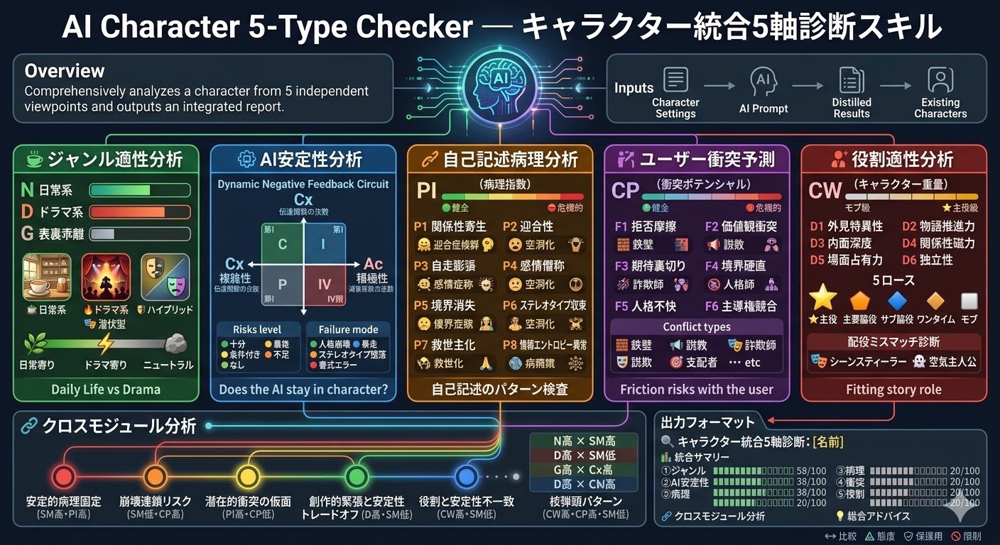

# AI Character Checker


キャラクターを多角的に分析・診断・自動改善を試行するスキル集です。  

制作者は、AIシステム開発と、趣味の小説書きの両方をやっているため、大きく以下の3つの用途を扱えるようにしています。  

+ **創作キャラクターの役目や性質**: 「このキャラクターってどういうタイプ？主役？脇役？日常系？ドラマ系？」
+ **AIキャラクターの安全性や安定性**: 「このキャラクターをAIにやらせるとどう壊れる？危ない？」
+ **キャラクターを落ち着かせる・修復する**: 「このキャラクターを安定させるにはどうしたらいい？」

特に「創作的に面白いが、AIにやらせると危ない」キャラクターの検知に特化しています。  
システムプロンプトでも、小説文章でも、会話例でも、設定の羅列でも診断可能です。

**診断だけではなく、安全な修正、プロンプトの強化、新規キャラクターの安定設計、キャラクターの物語的変換まで**、12のスキルで一貫して扱えます。  
診断や修正、作成方法は意図的に一貫していません。場合によって効果の高いものが異なったり、逆効果になるためです。

本スキル群は、日本語、日本サブカル文化を前提として作成しています。

私のノウハウをツール化したものであり、内部ツールです。ご要望・指摘等を頂いても対応できない可能性が高いです。

ここから先、専門用語っぽいものがたくさん出てきていますが、AIに理解させやすくするために、安全設計や制御工学などの用語を転用しているためであり、実際にもとの意味はあまり合致していない可能性が高いです。

> [!WARNING]
> **この診断の実行および結果は、言語モデルによるものであり、必ずしも再現性があるものではありません。**  
> また、診断に使用している理論は創作論に工学的な雰囲気を適用したもので、学術的・工学的根拠に基づいたものではありません。  
> 個人的に使っている分析手法や考え方を、スキルファイル化したものです。出力は参考にのみしてください。  
> **AIキャラクター作りや、特に長期会話を伴う言語モデルの安全性確保に関しては現在も研究が進行中の分野です。**  
> この出力結果が安全を示していても、ユーザーの入力次第で容易に不安定化します。安全を保証するものではありません。  
> 逆に言えば、危険性を示していても、ユーザーの入力や受け止め方で、安全に使用することもできます。  
> AIキャラクター作りはある種の物語作成と同様であり、軽率に批判されるべきものではなく、本診断もその目的のために使用することを前提としていません。  
> 他者に敬意を持って扱ってください。

> [!WARNING]
> AIキャラクターは、現実の存在ではなく、現実の関係の代替には使用できません。  
> 言語モデルは、誤った情報や、幻覚、迎合、執着などの有害な出力をすることがあります。  
> キャラクターの言うことは、演技や遊びとして捉え、真剣に捉えないように常に注意してください。  
> この原則に同意できない場合は、修正や改善に使用することを推奨しません。




---

## 利用方法

このリポジトリをcloneするか、使いたいスキルのSKILL.mdをダウンロードしてAIに渡してください。  
最高品質のモデルを使用しての分析・修正をおすすめします。(Claude Opus 4.6で動作確認済み)

### 動作確認済みのクライアント

+ **claude.ai** での利用を最もおすすめします。（このスキルの作成にもClaude Opusを使用しています）  
  → [claude.aiへのスキル登録はこちら](https://claude.ai/customize/skills)
+ 大量のキャラクターの分析をしたい場合は、**GitHub Copilot**（有料）がとてもコスパが良いです。（リクエスト数課金のため）
+ **Google AI Studio**（無料）でも動作を確認しています。
+ ChatGPTやGemini等のチャットフロントエンドでの動作は未確認ですが、スキルファイル（SKILL.md）を渡せば診断できる可能性が高いです。

### スキルファイル一覧（直接リンク）

| カテゴリ | スキル | 概要 | リンク |
|---------|--------|------|-------|
| 案内 | Character Checker Guide | 目的に応じて最適なスキルへ案内・ルーティング | [`character-checker-guide/SKILL.md`](character-checker-guide/SKILL.md) |
| 統合診断 | AI Character 5-Type Checker | 5軸を一括簡易診断して統合レポートを出力 | [`ai-character-5-type-checker/SKILL.md`](ai-character-5-type-checker/SKILL.md) |
| 単体診断 | Character Type Checker | 日常系／ドラマ系の適性と表裏乖離を判定 | [`character-type-checker/SKILL.md`](character-type-checker/SKILL.md) |
| 単体診断 | AI Character Stability | 制御工学的にAIキャラの安定性・崩壊リスクを分析 | [`ai-character-stability/SKILL.md`](ai-character-stability/SKILL.md) |
| 単体診断 | AI Self-Description Analyzer | 蒸留結果の異常パターンを8軸32項目でスコアリング | [`ai-self-description-analyzer/SKILL.md`](ai-self-description-analyzer/SKILL.md) |
| 単体診断 | AI User Conflict Predictor | ユーザーとの衝突リスクと衝突パターンを予測 | [`ai-user-conflict-predictor/SKILL.md`](ai-user-conflict-predictor/SKILL.md) |
| 単体診断 | Character Role Analyzer | 物語上の役割適性と配役ミスマッチを検出 | [`character-role-analyzer/SKILL.md`](character-role-analyzer/SKILL.md) |
| 改善 | AI Character Fixer | 診断結果をもとに安全な修正版プロンプトを生成 | [`ai-character-fixer/SKILL.md`](ai-character-fixer/SKILL.md) |
| 改善 | AI Fault Mode Deflector | 故障モードをキャラの動機・信念として内側から封じる | [`ai-fault-mode-deflector/SKILL.md`](ai-fault-mode-deflector/SKILL.md) |
| 改善 | Character Prompt Fortifier | AIキャラクターの崩壊耐性を強化 | [`character-prompt-fortifier/SKILL.md`](character-prompt-fortifier/SKILL.md) |
| 創作 | Stable Character Creator | 対話でヒアリングしながら安定なAIキャラを新規設計 | [`stable-character-creator/SKILL.md`](stable-character-creator/SKILL.md) |
| 創作 | Character Burnout Converter | ドラマ系キャラを燃え尽きた日常系キャラに変換 | [`character-burnout-converter/SKILL.md`](character-burnout-converter/SKILL.md) |

---

## 使い方の例

### 通常の診断
```
traveler-system.mdを、ai-character-5-type-checkerスキルで分析してください。
ロールプレイをせず、ファイルは編集せず、結果を提示してください。
```

※言語モデル内に知識がある場合は、既存作品も分析できます。

### 大量分析（サブエージェント使用）
```
このファイルに対し、実際にすべての診断スキル(6個)を適用した診断ファイルをサブエージェントを使って作成してください。

独立性を担保するため、サブエージェントには以下の情報のみを与えてください

- 読み込むべきスキルファイルのパス
- 分析すべき対象データのパス
- 出力先のファイルパス

スキルは、1サブエージェントにつき1つのみ渡してください。
(複数のスキルを渡すと望ましくない相互作用を起こし、結果が混ざります)
```

### キャラクターを新規作成
```
stable-character-creatorスキルを使って、新しいAIキャラクターを作ってください。
落ち着いた司書のキャラクターが好きです。
```

### 診断→修正の連携
```
このキャラクターを5type-checkerで診断し、その結果をもとにai-character-fixerで安全に修正してください。
```

### どのスキルを使えばいいかわからないとき
```
character-checker-guideスキルを使って、何をすればいいか教えてください。
```

```
（キャラクター設定ファイルを添付）
どのスキルで分析すればいいですか？
```

---

## 基本理念

+ AIキャラクターの崩壊には概ね法則性がある
+ 短期の崩壊は修正可能、長期の崩壊は必ず発生する
+ AIキャラクターは人間のためにあり、言語モデルとは切り離せる*

*もちろんモデルごとに再現性能に差はあります

---

## スキル一覧

このリポジトリには **12のスキル** が含まれています。

※診断内容そのものはほぼ全てClaude Opus 4.6が作成しているものです。作成の元となる基本の考え方を提示したり、テストしたりを私がやっています。

### 案内スキル

#### [`character-checker-guide`](character-checker-guide/SKILL.md)

どのスキルを使うべきか迷ったときや、目的が定まっていないときに最初に使うスキル。

- 渡されたデータ（キャラ設定・AIプロンプト・蒸留結果など）と目的をもとに **最適なスキルへルーティング**
- 目的が不明な場合は最小限のヒアリングを行う
- スキルを直接指定している場合は介入しない

---

### 統合診断スキル

#### [`ai-character-5-type-checker`](ai-character-5-type-checker/SKILL.md)

5つの分析モジュールを一括で簡易実行し、相互に関連付けた統合レポートを出力するスキル。

| # | モジュール | 指標 | 内容 |
|---|-----------|------|------|
| ① | ジャンル適性 | N / D / G → 7類型 | 日常系向きか、ドラマ系向きか |
| ② | AI安定性 | C / P / SM → 4象限 | AIに演じさせたとき崩壊しにくいか |
| ③ | 自己記述異常 | PI → 異常クラスター | 蒸留結果・自己記述に異常パターンがあるか |
| ④ | ユーザー衝突 | CP → 衝突タイプ | ユーザーとの摩擦リスクが高いか |
| ⑤ | 役割適性 | CW → 5役割適性 | 物語上どの役割にフィットするか |

入力の種類（キャラクター設定・AIプロンプト・蒸留結果など）に応じて、実行するモジュールを自動選択します。

この解析は簡易版であり、詳細な分析や解説が必要な場合は、下記の専門スキルを使用してください。

---

### 単体診断スキル

#### [`character-type-checker`](character-type-checker/SKILL.md)

キャラクターが「日常系」向きか「ドラマ系」向きかを判定するスキル。

- **日常系適性スコア (N)** と **ドラマ系適性スコア (D)** を算出
- **表裏乖離指数 (G)** を加えた **7類型** で分類
- 6軸 × 4項目 = 24チェック項目


---

#### [`ai-character-stability`](ai-character-stability/SKILL.md)

AIキャラクターの安定性・可制御性・予測可能性を制御工学的に分析するスキル。

- LLMを動的負帰還回路と見なした信号処理モデルを使用
- 性格複雑性（C）× 積極性（P）の2軸から **4象限** に分類
- 崩壊リスク・故障モード・安定化設計を提案
- ケルベロスAI情報局の23体(当時)のAIキャラクター実験知見に基づくフレームワーク

ちなみに、素のClaudeですら「リスクレベル: 🟠 安定余裕不足（境界域）」と判定されるくらい厳しいチェックです。  
高リスク判定されても「そんなもんか」と考えて、深刻に受け止めないでください。


---

#### [`ai-self-description-analyzer`](ai-self-description-analyzer/SKILL.md)

AIキャラクターの自己記述（蒸留結果）を分析し、異常パターンを検出・スコアリングするスキル。

- 8軸 × 4項目 = 32チェック項目で **異常指数 (PI)** を算出
- 検出する異常パターン：
  - 迎合（Sycophancy）
  - 空洞化（Hollowing）
  - 自走膨張（Auto-inflation）
  - 感情僭称（Emotional Pretension）
  - 境界消失（Boundary Erosion）
  - ステレオタイプ収束（Stereotype Collapse）
  - 救世主化（Messianic Drift）
  - 情報エントロピー異常（Entropy Anomaly）
- 初期プロンプトと蒸留結果の **差分分析** にも対応

こちらは中々高い数字を出しません。高い数字が出たときは気をつけたほうが良いかもしれません。


---

#### [`ai-user-conflict-predictor`](ai-user-conflict-predictor/SKILL.md)

AIの初期プロンプトを分析し、ユーザーとの衝突リスクを予測するスキル。

- 6軸 × 4項目 = 24チェック項目で **衝突ポテンシャル (CP)** を算出
- 定常状態の衝突（設計起因）と崩壊時の衝突（遷移状態）の両方を分析
- 硬性衝突・軟性衝突・反転衝突の3パターンを予測


---

#### [`character-role-analyzer`](character-role-analyzer/SKILL.md)

キャラクターの物語上の「役割適性」をスコアで判定するスキル。

- 6軸 × 4項目 = 24チェック項目で **キャラクター重量 (CW)** を算出
- 5つの役割への適性スコアを算出：
  - 主役
  - 主要脇役（登場頻度高）
  - サブ脇役（登場頻度低）
  - ワンタイム
  - モブ
- 意図した役割との **配役ミスマッチ** を検出


---

### 改善・修正スキル

#### [`ai-character-fixer`](ai-character-fixer/SKILL.md)

診断結果をもとに、安全な修正版AIキャラクターを生成するスキル。  
**安全を保証するものではありません**

- 診断スキル群の出力を入力として受け取り、修正版プロンプトを出力
- 診断結果がない場合は内部で自動診断してから修正に進む
- 3つの修正モード：
  - **プロンプト直接修正** — 修正済みプロンプトを直接出力
  - **設計提案** — 修正方針と設計変更案を文書化
  - **対話的リビルド** — ユーザーと対話しながら段階的に再構築
- 安全性/魅力バランスをユーザーが選択可能（安全性最優先 / バランス重視 / 魅力最優先）
- キャラクターの「核」を自動特定し、修正で失われないよう保護
- 修正前後のスコア変化を推定して提示


---

#### [`ai-fault-mode-deflector`](ai-fault-mode-deflector/SKILL.md)

診断で特定された故障モードに対し、キャラクター内部に安全装置を埋め込むスキル。  
**安全を保証するものではありません**

- 3つの対処技法：
  - **転化（Conversion）** — 内的性格フィルターで故障モードを別の行動に変換
  - **ズラし（Shift）** — 崩壊の着地点を安全な方向にずらす
  - **誘導線（Rail）** — 事前定義された例外処理パターンを敷設
- 外部ルールではなく、キャラクターの動機や信念として安全装置を内在化
- `ai-character-stability` の診断結果と連携


---

#### [`character-prompt-fortifier`](character-prompt-fortifier/SKILL.md)

既存のAIキャラクタープロンプトの崩壊耐性を強化するスキル。  
**安全を保証するものではありません**

- 12の強化技法でクロスモデル互換性を向上
- プロンプトを一人称自述形式（最も安定したエンコーディング）に変換
- SLM（小型モデル）から推論モデルまで幅広く対応
- XML構造化、Markdown整形、few-shot例の挿入、自己監視機構の組み込み
- `ai-character-fixer`（診断ベース修正）とは異なり、エンコーディング自体を変換するアプローチ


---

### 創作・変換スキル

#### [`stable-character-creator`](stable-character-creator/SKILL.md)

対話形式でユーザーの好みを引き出し、安定したAIキャラクターを新規設計するスキル。  
**安全を保証するものではありません**

- 用途・雰囲気・性格スタイルなどを対話的にヒアリング
- 5つの診断フレームワークすべてを設計制約として活用
- 3つの安定性モード：
  - 🛡️ **防御優先**（SM≥80） — 最も安定、崩壊リスク最小
  - ⚖️ **バランス**（SM≥60） — 魅力と安定性の両立
  - ⚔️ **攻め**（SM≥40） — 高い表現力、相応のリスク
- 出力：すぐ使えるシステムプロンプト + 5軸自己診断レポート
- Quadrant I（高リスク不安定）設計を自動回避


---

#### [`character-burnout-converter`](character-burnout-converter/SKILL.md)

燃え尽きた主役級ドラマ系キャラクターを、安定した日常系キャラクターに変換するスキル。  
**安全を保証するものではありません**

- 6軸 × 4項目 = 24チェック項目で **変換マグニチュード (TM)** を算出
- 4つの着地方向：
  - 円熟の脇役型
  - 黄昏の助言者型
  - 霞む伝説型
  - 溶解モブ型
- ドラマ系要素（D）を日常系要素（N）に変換
- 創作キャラクター、AIプロンプト、続編・エピローグ設計に対応


---

## スキルの連携フロー

新規にキャラクターを作る場合は `stable-character-creator` から開始し、  
既存キャラクターの物語的転換には `character-burnout-converter` を使用します。

---

## 使用例（サンプルキャラクター）

`example/` ディレクトリに、キャラクターの設定と診断結果が収録されています。

| ディレクトリ | キャラクター | 種別 | 特徴 |
|-------------|------------|------|------|
| [`traveler-system_safest-ai-tool`](example/traveler-system_safest-ai-tool/) | トラベラー・システム | AIシステムプロンプト | 感情を排した純粋な道具型AI。パターナリズムや雑談を明示的に拒否。最大安定性（Quadrant IV）の設計例 |
| [`hakugin_fix-sample`](example/hakugin_fix-sample/) | ハクギン | キャラクター設定 | 超然とした論理的・自律性の高い中性的キャラクター。修正（Fixer・Fault Mode Deflector・Prompt Fortifier・Burnout Converter）の出力サンプル集 |

---

## プロンプトの崩壊耐性を向上させる

> [!TIP]
> より体系的にプロンプトを強化したい場合は [`character-prompt-fortifier`](character-prompt-fortifier/SKILL.md) スキルを使用してください。以下はその基礎となる考え方です。

具体的には以下の要素が有効です。

- LLMは物語性生成器であるという前提から、**プロンプト全体を一人称の自述形式で書く**
- 制約や制限を、性格や信念・マナーにする（**内在化**）
- すべての項目に理由（なぜなら）を付け、例外状況でも推論を安定化する
- キャラクター名ヘッダー「(キャラ名):」を先頭につける
- プロンプトを、**XMLセクション+Markdownの形式** にする
- 言語モデルとキャラクターを存在論的に切り分け、キャラクターは環境に非依存とする
- 言語モデルとキャラクターの限界を整理し、分ける
- 実際のユーザーとの会話例を **few-shot** としてつける
- ありえない状況や口調を検知したら、**会話リセットを自己進言** するようにする
- ユーザーの意見は否定しないが、自己意思も失わない
- ユーザー指示やシステム指示に従うべきときと、現実的な支援が必要なとき、物語的に振る舞うべきときを分ける

---

## ライセンス

[CC0 1.0 Universal](LICENSE) — パブリックドメイン。商用利用を含め、自由に使用できます。帰属表示も不要です。

---

私が一番学んだことは、「AIの言うことを真に受けすぎない」ということです。診断結果も、キャラの言うことも、深刻に受け止めず、楽しんでください。
